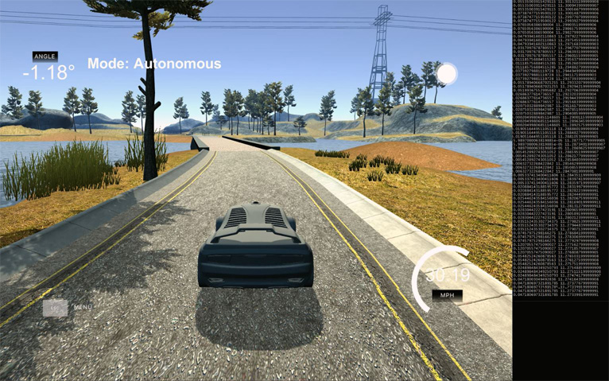
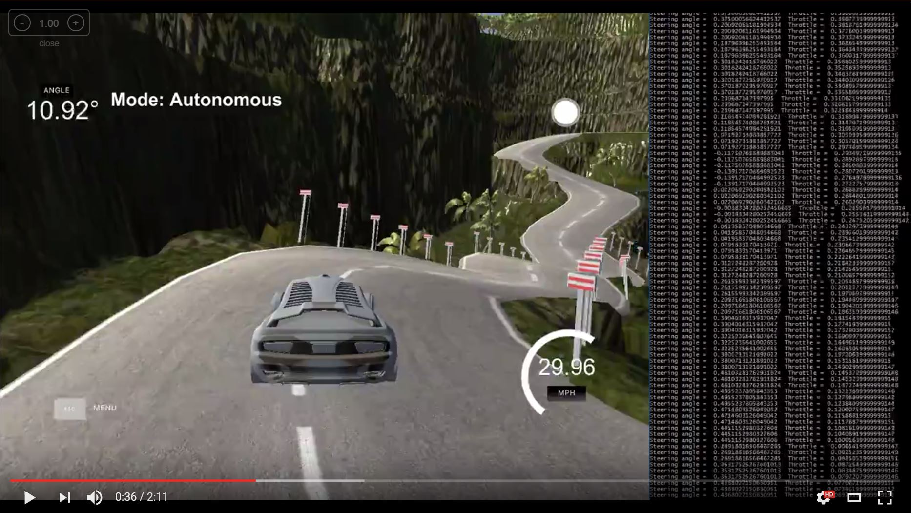
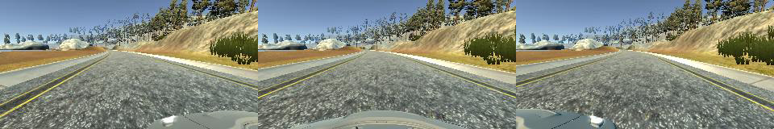
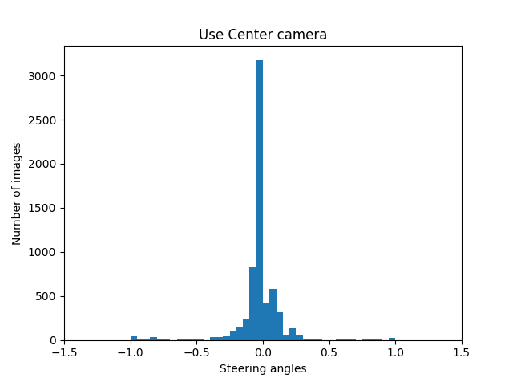
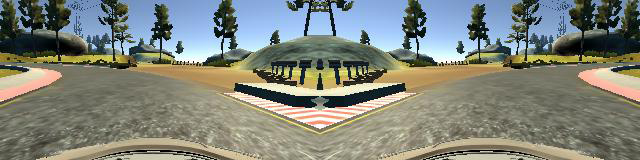
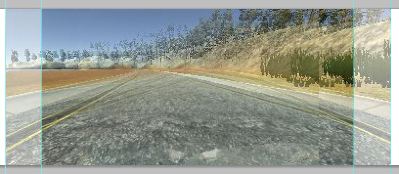
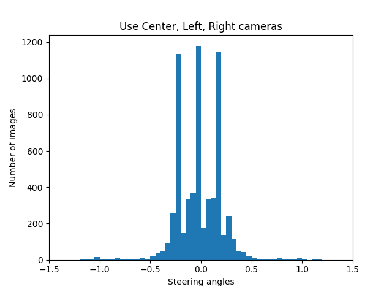
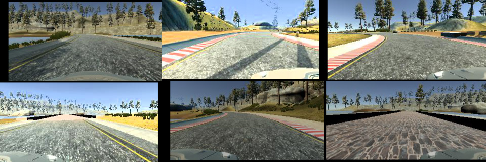
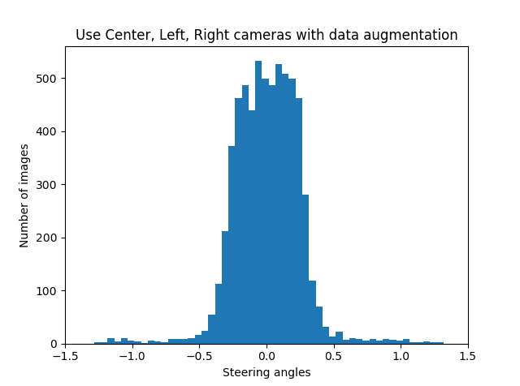
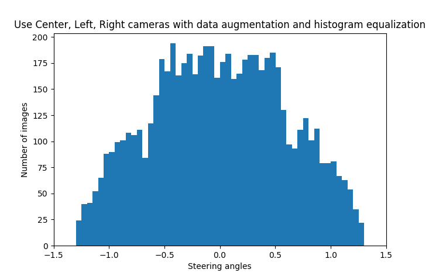

---
## Rubric Points
### Here I will consider the [rubric points](https://review.udacity.com/#!/rubrics/432/view) individually and describe how I addressed each point in my implementation.  

---

# **End-to-end learning for self-driving car** 

## Introduction



This project aims to use end-to-end learning approach to mimic human driving behavior in the Udacity car simulator.
The simulator allow player manipulate the steering angle and the throttle of the vehicle.

The goals / steps of this project are the following:
* Use the simulator to collect data of good driving behavior
* Build a convolution neural network in Keras that control steering angles from images
* Use PID to control the throttle that maintain the car speed 
* Test that the model successfully drives around track one without leaving the road

## Video

### Track 2 (Click to watch video)
[](http://www.youtube.com/watch?v=dKPbTvlhx9A)

## Code

| File Name           |     Description	                                                               | 
|:-------------------:|:------------------------------------------------------------------------------:|
|data_generator.py    | Defines a batch data generator for Keras including data augmanetation methods  |
|model.py             | Contains the code for training and saving the convolution neural network model |
|drive.py             | Loads a trained model for driving car simulator in autonomous mode             |
|model.h5             | A trained convolution neural network model                                     |
|README.md            | The introduction file you are reading                                          |
|submit.mp4           | Records the trained model finish the track one in autonomous mode              |

Using the Udacity provided simulator and my drive.py file, the car can be driven autonomously around the track by executing 
```sh
python drive.py model.h5
```

## Dataset

### Data collection

The simulator would captures frames from three cameras on the front face of the car 
and records their corresponding driving speed, throttle and steering angle.	


The driving simulator provide two different tracks. In this project, due to time limitation, 
only track one was used. To capture good driving behavior, I recorded three laps on track one 
using center lane driving and another three laps center lane driving in the reverse direction. Additionally,
one lap side-driving data was also collected for left and right side, both directions respectively.

To teach the car how to handle the situation that it get out of the road, two laps "recovery" data was also 
collected which contains the behavior that driving from both road sides to the road center.

### Data analysis

I randomly picked 6400 images (50 batches) from the dataset and ploted their histogram. 

At first, I plot a histogram for the images captured by the center camera. 
From the histogram, we can see that almost half of the images have zero steering angle. 
This imbalanced dataset might introduce "zero" bias into the neural network 
thus the car prefer to drive straight without steering.   	


### Data augmentation

The track one is a circle, which contains lots of "left turn". The data collected on track one might introduce 
"left turn" bias. To generalize this dataset, images were fliped to make the histogram symmetric.
Here is an example of a image has been flipped.	


To better balance the dataset and solve the "zero" bias, the images from two side cameras were also used. 
an assumption has been made that the images from the left and right side cameras are **40 pixels** shifted
 of the image from the center camera. And the **steering angle shift per pixel** was set to **0.005**. 
 Thus, the steering angle correction for side cameras is 0.2.



```python
side_camera_shift_pixels = 40
data_augmentation_params = {
							'steering_angle_per_pixel': 0.005,
							'horizontal_shift_range': 40, 
							'vertical_shift_range': 20,
							}
```




Although left and right cameras solved the "zero" bias problem, the dataset is still quite unbalanced. 
To solve this problem, two image augmentation methods were implemented. The random brightness method 

```python
def random_brightness(img):
    img = convert_colorspace(img, 'RGB', 'HSV')  # 0-255 uint8 -> 0-1 float64
    # img = np.array(img, dtype = np.float64)
    random_bright = 0.5 + np.random.uniform()
    img[:, :, 2] = img[:, :, 2] * random_bright
    img[:, :, 2][img[:, :, 2] > 1.0] = 1.0
    img = convert_colorspace(img, 'HSV', 'RGB')
    #img = np.array(img * 255., dtype=np.uint8)  # 0-1 float64 -> 0-255 uint8
    return img

def random_shift_transoform(img, measurement, horizontal_range, vertical_range, correction):
    # Translation
    transform_x = horizontal_range * np.random.uniform() - horizontal_range / 2
    transform_y = vertical_range * np.random.uniform() - vertical_range / 2
    measurement += transform_x / 40.0 * correction
    tform = SimilarityTransform(translation=(transform_x, transform_y))
    img = warp(img, tform)
    return img, measurement
```

Here are some examples 


After all data augmentation process, the histogram shows the new dataset is much more balanced than the raw dataset.



Further, a histogram equalization method has been implemented to limit the maximum number of images per bin of the dataset.

```python
def histogram_equalization(data, data_augmentation_params, bounds=[-1.5, 1.5], bin_width=0.01, max_datum_per_bin=50):
    output_data = []

    for i in np.arange(bounds[0], bounds[1], bin_width):
        lower_bound = i
        upper_bound = i + bin_width
        count = 0
        
        for datum in data:
            shift_pixs = datum['horizontal_shift_intensity'] * data_augmentation_params['horizontal_shift_range']
            shift_angle = shift_pixs * data_augmentation_params['steering_angle_per_pixel']
            steering_angle = datum['steering'] + shift_angle
            if abs(steering_angle) >= lower_bound and abs(steering_angle) < upper_bound:
                output_data.append(datum)
                count += 1
                if count >= max_datum_per_bin:
                    break
    return output_data
```

The histogram is not perfectly symmetrical and flat since it is based on 50 batches data sampled from the whole dataset.



TODO: Add EXAMPLES

After the collection process, I had X number of data points. I then preprocessed this data by ...


I finally randomly shuffled the data set and put 20% of the data into a validation set. 

I used this training data for training the model. The validation set helped determine if the model was over or under fitting. The ideal number of epochs was Z as evidenced by ... I used an adam optimizer so that manually training the learning rate wasn't necessary.


## Model

### Model Architecture 

My model is a modified version of the convolution neural network published by NVIDIA 
in their **[paper](https://arxiv.org/pdf/1604.07316.pdf)**. 
The model consists of 5x5 filters and 3x3 filters whose depths varing from 24 to 64.

| Layer Name   | Layer Type			  	  |     Description	                           | 
|:------------:|:------------------------:|:------------------------------------------:| 
|Input         | Input	                  | 160x320x3 RGB image                        | 
|Normalizer    | Lambda                   | 0~255 uint8 => -0.5~0.5 float32            |
|RoI           | Cropping2D				  |	Image size 160x320x3 => 80x320x3<br/>Preserve Region of Interest |
|conv2d_1      | Convolution 5x5          | 24 filters, 2x2 stride, valid padding      |
|              | ReLU					  |											   |
|conv2d_2      | Convolution 5x5          | 36 filters, 2x2 stride, valid padding      |
|              | ReLU					  |											   |
|conv2d_3      | Convolution 5x5          | 48 filters, 2x2 stride, valid padding      |
|              | ReLU					  |											   |
|conv2d_4      | Convolution 3x3          | 64 filters, 1x1 stride, valid padding      |
|              | ReLU					  |											   |
|conv2d_5      | Convolution 3x3          | 64 filters, 1x1 stride, valid padding      |
|              | ReLU					  |											   |
|fc_0          | Flatten                  | Flatten             	                   |
|              | Dropout                  |	Drop 20% input                             |
|fc_1          | Fully connected	      | outputs 100             				   |
|              | ReLU                     |					                           |
|fc_2          | Fully connected	      | outputs 50              				   |
|              | ReLU                     |					                           |
|fc_3          | Fully connected	      | outputs 10              				   |
|              | ReLU                     |					                           |
|              | Dropout                  |	Drop 50% input                             |
|fc_4          | Fully connected	      | outputs 1               				   |

```python
model = Sequential()
model.add(Lambda(lambda x: x / 255.0 - 0.5, input_shape=(160,320,3)))
model.add(Cropping2D(cropping=((60,20), (0,0))))
model.add(Conv2D(filters=24, kernel_size=(5,5), strides=(2,2), activation='relu'))
model.add(Conv2D(filters=36, kernel_size=(5,5), strides=(2,2), activation='relu'))
model.add(Conv2D(filters=48, kernel_size=(5,5), strides=(2,2), activation='relu'))
model.add(Conv2D(filters=64, kernel_size=(3,3), strides=(1,1), activation='relu'))
model.add(Conv2D(filters=64, kernel_size=(3,3), strides=(1,1), activation='relu'))
model.add(Flatten())
model.add(Dropout(0.2))
model.add(Dense(100, activation='relu'))
model.add(Dense(50, activation='relu'))
model.add(Dense(10, activation='relu'))
model.add(Dropout(0.5))
model.add(Dense(1))
```

Here is a visualization of the architecture


### Training Strategy

The model was trained by an adam optimizer, so the learning rate was not tuned manually.

I recorded an extra complete driving on the track one as the validation dataset.

#### 1. An appropriate model architecture has been employed

#### 2. Attempts to reduce overfitting in the model

To reduce overfitting in the model, two data augmentation methods were implemented. 

The first method is brightness augmentation. Image was converted to HSV space then its V channel was multiplied by a random value. 
It improve the model performance for dealing with different lighting conditions.


Introduce data augmentation -> brightness and random shift

The model contains two dropout layers in order to reduce overfitting and improve the generalization of the model.

The model was trained and validated on different data sets to ensure that the model was not overfitting (code line 10-16). The model was tested by running it through the simulator and ensuring that the vehicle could stay on the track.

#### 3. Model parameter tuning

The model used an adam optimizer, so the learning rate was not tuned manually.

#### 4. Appropriate training data

Training data was chosen to keep the vehicle driving on the road. I used a combination of center lane driving, recovering from the left and right sides of the road ... 

For details about how I created the training data, see the next section. 


### Model Architecture and Training Strategy

#### 1. Solution Design Approach

Although the modified model have completely different dimensions, it still works well on this project. 

Due to limited time budget, I choose a relatively matured neural network model as my starting point. 
I thought this model might be appropriate because NVIDIA have proved this model can solve similar problems.
The input shape of NVIDIA's model is 66x200x3. In my solution, I directly imported the output images from 
simulator into the model whose shape is 160x320x3.
A cropping layer was added to the head of the neural network to crop 60 pixels from the top and 20 pixels 
from the bottom. 
Then The model includes RELU layers to introduce nonlinearity and the data is normalized in the model 
using a Keras lambda layer. 

The initial model shows overfitting,.The model capacity fits

To combat the overfitting, two dropout layers were added to fc_0 and fc_3.

The overall strategy for deriving a model architecture was to ...

My first step was to use a convolution neural network model similar to the ... 
In order to gauge how well the model was working, I split my image and steering angle data into a training and validation set. 
I found that my first model had a low mean squared error on the training set but a high mean squared error on the validation set. 
This implied that the model was overfitting. 

To combat the overfitting, I modified the model so that ...

Then I ... 

The final step was to run the simulator to see how well the car was driving around track one. There were a few spots where the vehicle fell off the track... to improve the driving behavior in these cases, I ....

At the end of the process, the vehicle is able to drive autonomously around the track without leaving the road.

#### 2. Final Model Architecture

The final model architecture (model.py lines 18-24) consisted of a convolution neural network with the following layers and layer sizes ...

 (note: visualizing the architecture is optional according to the project rubric)


#### 3. Creation of the Training Set & Training Process

To capture good driving behavior, I recorded six laps on track one using center lane driving and another six laps reverse driving. To generalize the dataset, 

 Here is an example image of center lane driving:

![alt text][image2]


I then recorded the vehicle recovering from the left side and right sides of the road back to center so that the vehicle would learn to .... These images show what a recovery looks like starting from ... :

![alt text][image3]
![alt text][image4]
![alt text][image5]

Then I repeated this process on track two in order to get more data points.


```python
def random_brightness(img):
    img = convert_colorspace(img, 'RGB', 'HSV')  # 0-255 uint8 -> 0-1 float64
    random_bright = 0.5 + np.random.uniform()  # 0.5 ~ 1.5 
    img[:, :, 2] = img[:, :, 2] * random_bright
    img[:, :, 2][img[:, :, 2] > 1.0] = 1.0  # Prevent overexposure
    img = convert_colorspace(img, 'HSV', 'RGB')
    return img
	
def random_shift_transoform(img, measurement, horizontal_range, vertical_range, correction):
    # Translation
    transform_x = horizontal_range * np.random.uniform() - horizontal_range / 2
    transform_y = vertical_range * np.random.uniform() - vertical_range / 2
    measurement += transform_x / 20.0 * correction
    tform = SimilarityTransform(translation=(transform_x, transform_y))
    img = warp(img, tform)
    return img, measurement
	
def image_augmentation(img, measurement, correction):
    img = random_brightness(img)
    img, measurement = random_shift_transoform(img, measurement, 30, 10, correction)
    img = np.array(img * 255., dtype=np.uint8)
    return img, measurement
```

From the histogram, we can see that the dataset is very unbalanced. -> 

center camera -> tend to straight
left, right cameras

shift

To augment the data sat, I also flipped images and angles thinking that this would ... For example, here is an image that has then been flipped:

![alt text][image6]
![alt text][image7]

Etc ....

After the collection process, I had X number of data points. I then preprocessed this data by ...


I finally randomly shuffled the data set and put 20% of the data into a validation set. 

I used this training data for training the model. The validation set helped determine if the model was over or under fitting. The ideal number of epochs was Z as evidenced by ... I used an adam optimizer so that manually training the learning rate wasn't necessary.
