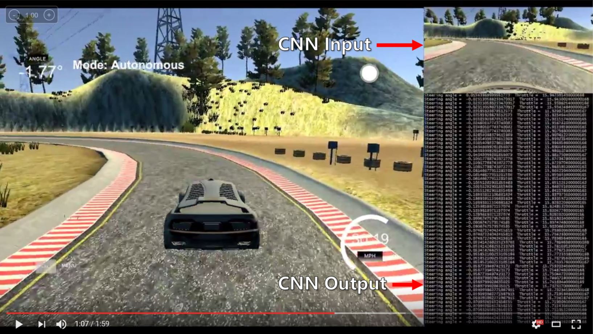
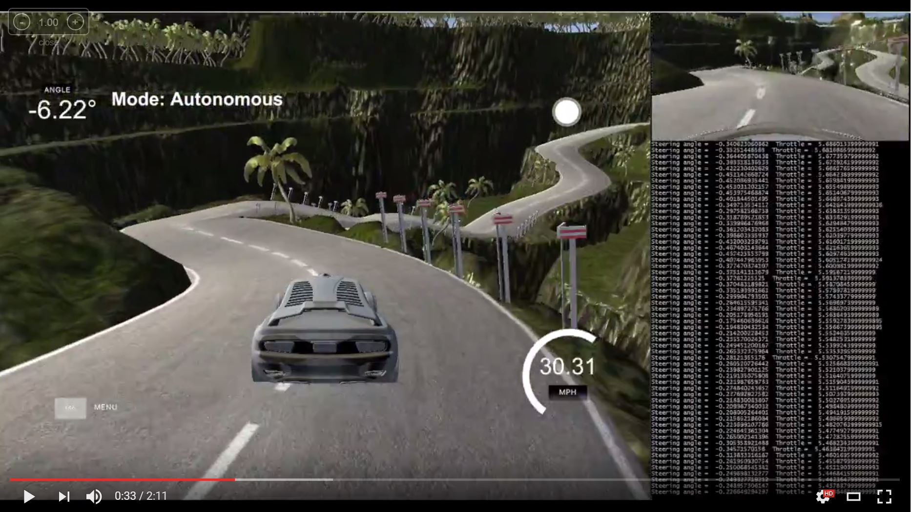
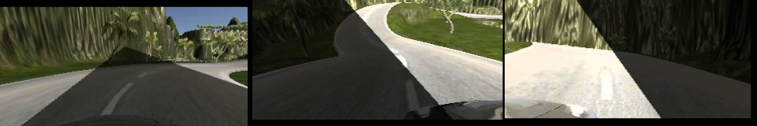

# **End-to-end learning for self-driving car** 

## Introduction


This project aims to use end-to-end learning approach to mimic human driving behavior in the Udacity car simulator.
The simulator allow player manipulate the steering angle and the throttle of the vehicle.

The steps of this project are the following:
* Use the simulator to collect data of good driving behavior.
* Train a convolution neural network in Keras that predict steering angles from images.
* Use PID to control the throttle that maintain the car speed.
* Test that the model successfully drives around both tracks without leaving the road.

## Video

### Track 1 (Click to watch video)
[](http://www.youtube.com/watch?v=_iEak8Dfe60)

### Track 2 (Click to watch video)
[](http://www.youtube.com/watch?v=ffjRmra8jyM)

## Code

| File Name            |     Description	                                                            | 
|:--------------------:|:------------------------------------------------------------------------------:|
|csv_image_generator.py| Defines a batch data generator for Keras including data augmanetation methods  |
|data.py               | Defines the paths of training dataset and validation dataset                   |
|model.py              | Contains the code for training and saving the convolution neural network model |
|drive.py              | Loads a trained model for driving car simulator in autonomous mode             |
|model.h5              | A trained convolution neural network model                                     |
|README.md             | The introduction file you are reading                                          |

Using the Udacity provided simulator and my drive.py file, the car can be driven autonomously around the track by executing 
```sh
python drive.py model.h5
```

## Dataset

### Data collection

To train a neural network to mimic my driving behavior, a driving behavior dataset need to be collected. 
In this project, the car simulator is able to capture frames from three cameras on the front face of the car 
and records the corresponding driving behaviors (driving speed, throttle and steering angle).	


The driving simulator provide two different tracks. In this project, I developed all my methods with the first track.
After the model performs well on the first track, I added the second track data into my dataset thus the model can work on both tracks.
To capture good driving behavior, I recorded two laps using center lane driving and another two laps center lane driving in the reverse direction. 
Additionally, one lap side-driving data was also collected for left and right side, both directions respectively.

To teach the car how to handle the situation that it get out of the road, one lap "recovery" data was also 
collected which contains the behavior that driving from both road sides to the road center.

### Data analysis

To analyze the dataset collected from the first track, I randomly picked 6400 images (50 batches) from the dataset and ploted their histogram. 

At first, I plot a histogram for the images captured by the center camera. 
From the histogram, we can see that almost half of the images have zero steering angle. 
This imbalanced dataset might introduce "zero" bias into the neural network 
thus the car prefer to drive straight without steering.   	


### Data augmentation

The track one is a circle, which contains lots of "left turn". The data collected on track one will introduce 
"left turn" bias into the neural network. To generalize this dataset, images were horizontally fliped to make the histogram symmetric.
Here is an example of a image has been horizontally flipped.	


To better balance the dataset and solve the "zero" bias, the images from two side cameras were also used. 
an assumption has been made that the images from the left and right side cameras are **40 pixels** shifted
 of the image from the center camera. And the **steering angle shift per pixel** was set to **0.005**. 
 Thus, the steering angle correction for side cameras is 0.2.


```python
side_camera_shift_pixels = 40
data_augmentation_params = {
							'steering_angle_per_pixel': 0.005,
							'horizontal_shift_range': 40, 
							'vertical_shift_range': 20,
							}
```


Although left and right cameras solved the "zero" bias problem, the dataset is still quite unbalanced. 
To solve this problem, three image augmentation methods were implemented. The random brightness method 

```python
def random_brightness(img):
    img = convert_colorspace(img, 'RGB', 'HSV')  # 0-255 uint8 -> 0-1 float64
    # img = np.array(img, dtype = np.float64)
    random_bright = 0.5 + np.random.uniform()
    img[:, :, 2] = img[:, :, 2] * random_bright
    img[:, :, 2][img[:, :, 2] > 1.0] = 1.0
    img = convert_colorspace(img, 'HSV', 'RGB')
    #img = np.array(img * 255., dtype=np.uint8)  # 0-1 float64 -> 0-255 uint8
    return img

def random_shift_transoform(img, measurement, horizontal_range, vertical_range, correction):
    # Translation
    transform_x = horizontal_range * np.random.uniform() - horizontal_range / 2
    transform_y = vertical_range * np.random.uniform() - vertical_range / 2
    measurement += transform_x / 40.0 * correction
    tform = SimilarityTransform(translation=(transform_x, transform_y))
    img = warp(img, tform)
    return img, measurement
	
def random_shadow(img):   
    h, w = img.shape[0], img.shape[1]
   
	# Pick two random points on the left side of image
    left_y = np.random.randint(-1*h, 2*h, 2)
	# Pick two random points on the right side of image
    right_y = np.random.randint(-1*h, 2*h, 2)
    
    if left_y[0] == right_y[0] or left_y[1] == right_y[1]:
        return img
		
    img = convert_colorspace(img, 'RGB', 'HSV')  # 0-1 float64
    X_m = np.mgrid[0:img.shape[0],0:img.shape[1]][1] # x coordinates of mask
    Y_m = np.mgrid[0:img.shape[0],0:img.shape[1]][0] # y coordinates of mask

    # line defined by (0, left_y[0]) and (w, right_y[0])
	line1 = ((Y_m - right_y[0]) / (left_y[0] - right_y[0]) - (X_m - w) / (0.0 - w))
	# mask1: area lower than line1
    shadow_mask_1 = line1 <= 0
    # line defined by (0, left_y[1]) and (w, right_y[1])
	line2 = ((Y_m - right_y[1]) / (left_y[1] - right_y[1]) - (X_m - w) / (0.0 - w))
	# mask2: area higher than line2
    shadow_mask_2 = line2 >= 0
    
	# Combine mask1 and mask2
    shadow_mask = (shadow_mask_1 & shadow_mask_2)
    
	# Reduce brightness inside the shadow mask area.
    img[shadow_mask, 2] *= np.random.uniform() * 0.3 + 0.2 # 0.2 ~ 0.5
    
    img = convert_colorspace(img, 'HSV', 'RGB')
    return img
```

Here are some examples for random brightness and random shift transform.


Combined random shadow,


After all data augmentation process, the histogram shows the new dataset is much more balanced than the raw dataset.


Further, a histogram equalization method has been implemented to limit the maximum number of images per bin of the dataset.

```python
def histogram_equalization(data, data_augmentation_params, bounds=[-1.5, 1.5], bin_width=0.01, max_datum_per_bin=50):
    output_data = []

    for i in np.arange(bounds[0], bounds[1], bin_width):
        lower_bound = i
        upper_bound = i + bin_width
        count = 0
        
        for datum in data:
            shift_pixs = datum['horizontal_shift_intensity'] * data_augmentation_params['horizontal_shift_range']
            shift_angle = shift_pixs * data_augmentation_params['steering_angle_per_pixel']
            steering_angle = datum['steering'] + shift_angle
            if abs(steering_angle) >= lower_bound and abs(steering_angle) < upper_bound:
                output_data.append(datum)
                count += 1
                if count >= max_datum_per_bin:
                    break
    return output_data
```

The histogram is not perfectly symmetrical and flat since it is based on 50 batches data sampled from the whole dataset.


I finally randomly shuffled the dataset and used this training data for training the model.
An extra complete circle driving hehavior on the first track was collected as my validation set. 
The validation set helped determine if the model was over or under fitting. 

## Model

### Model Architecture 

My model is a modified version of the convolution neural network published by NVIDIA 
in their **[paper](https://arxiv.org/pdf/1604.07316.pdf)**. 
The model consists of 5x5 filters and 3x3 filters whose depths varing from 24 to 64.

| Layer Name   | Layer Type			  	  |     Description	                           | 
|:------------:|:------------------------:|:------------------------------------------:| 
|Input         | Input	                  | 160x320x3 RGB image                        | 
|Normalizer    | Lambda                   | [0,255] uint8 => [-0.5,0.5] float32        |
|RoI           | Cropping2D				  |	Image size 160x320x3 => 80x320x3<br/>Preserve Region of Interest |
|conv2d_1      | Convolution 5x5          | 24 filters, 2x2 stride, valid padding      |
|              | ReLU					  |											   |
|conv2d_2      | Convolution 5x5          | 36 filters, 2x2 stride, valid padding      |
|              | ReLU					  |											   |
|conv2d_3      | Convolution 5x5          | 48 filters, 2x2 stride, valid padding      |
|              | ReLU					  |											   |
|conv2d_4      | Convolution 3x3          | 64 filters, 1x1 stride, valid padding      |
|              | ReLU					  |											   |
|conv2d_5      | Convolution 3x3          | 64 filters, 1x1 stride, valid padding      |
|              | ReLU					  |											   |
|fc_0          | Flatten                  | Flatten             	                   |
|              | Dropout                  |	Drop 20% input                             |
|fc_1          | Fully connected	      | outputs 100             				   |
|              | ReLU                     |					                           |
|fc_2          | Fully connected	      | outputs 50              				   |
|              | ReLU                     |					                           |
|fc_3          | Fully connected	      | outputs 10              				   |
|              | ReLU                     |					                           |
|              | Dropout                  |	Drop 50% input                             |
|fc_4          | Fully connected	      | outputs 1               				   |

```python
model = Sequential()
model.add(Lambda(lambda x: x / 255.0 - 0.5, input_shape=(160,320,3)))
model.add(Cropping2D(cropping=((60,20), (0,0))))
model.add(Conv2D(filters=24, kernel_size=(5,5), strides=(2,2), activation='relu'))
model.add(Conv2D(filters=36, kernel_size=(5,5), strides=(2,2), activation='relu'))
model.add(Conv2D(filters=48, kernel_size=(5,5), strides=(2,2), activation='relu'))
model.add(Conv2D(filters=64, kernel_size=(3,3), strides=(1,1), activation='relu'))
model.add(Conv2D(filters=64, kernel_size=(3,3), strides=(1,1), activation='relu'))
model.add(Flatten())
model.add(Dropout(0.2))
model.add(Dense(100, activation='relu'))
model.add(Dense(50, activation='relu'))
model.add(Dense(10, activation='relu'))
model.add(Dropout(0.5))
model.add(Dense(1))
```

Here is a visualization of the architecture

TODO: Add neural network structure, visualization etc.

### Training Strategy

TODO: Add training process